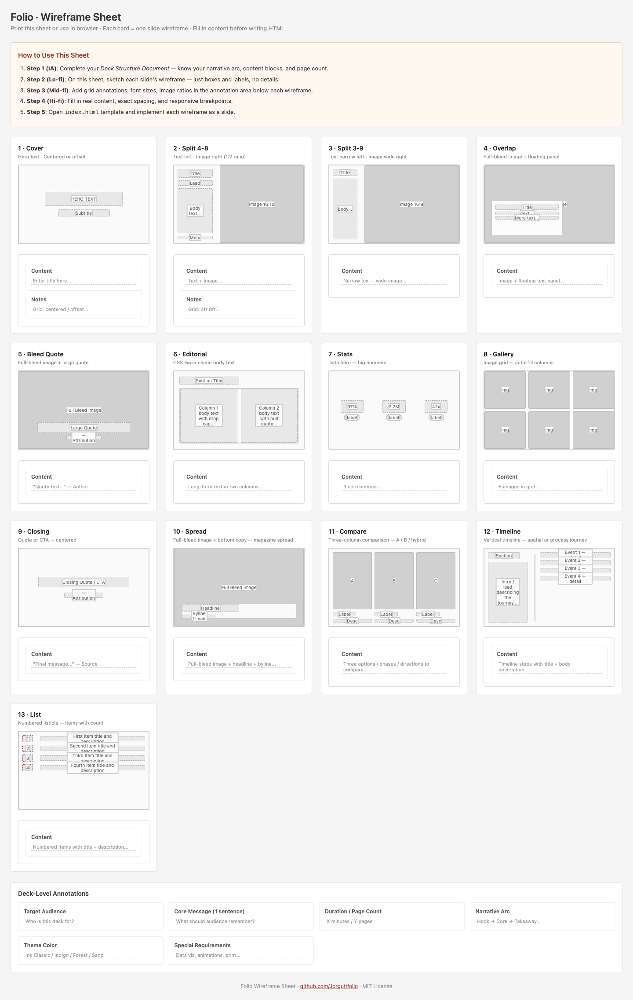

<p align="center">
  <a href="#english">🇬🇧 English</a> · <a href="#chinese">🇨🇳 中文</a>
</p>

---

<a id="english"></a>

# Folio · Design Intelligence Engine


> Magazine-style presentation engine. Structured content → template-driven layout → editable formats.

```text
You describe what you need → Folio generates the deck → export to any format → refine in your tool of choice
```

Single source, multiple outputs: **HTML / PPTX / PDF / Figma / IDML**. Auto-generated layout, manually editable after export.

<p align="center">
  
  
</p>

---

## Quick Start

Open Claude (or any AI with this Skill loaded) and say:

> **"Use Folio to make a presentation about [your topic], export as HTML."**

The AI will walk through:
1. **Content** — How many slides? What goes on each page? Any images?
2. **Style** — Pick from 10 visual styles, or describe the feeling for a recommendation
3. **Output** — HTML / PPTX / PDF / Figma / IDML

That's it. You get your deck.

---

## When to Use Folio

| Scenario | Works well | Not for |
|----------|------------|---------|
| Portfolio / Project review | ✅ Magazine-grade layout, no design skills needed | |
| Product launch / Pitch deck | ✅ Fast turnaround, consistent quality | |
| Academic presentation | ✅ Clean, professional, PDF-ready | |
| Figma design → presentation | ✅ C2D high-fidelity import | |
| Content that changes often | ✅ Edit content without touching layout | |
| Highly custom animations | | ❌ Not a frontend framework |
| 50+ page documents | | ❌ Optimized for 6-20 slides |

---

## How It Works

```text
Your request
    ↓
Folio determines: platform → audience → style → interaction level
    ↓
Template selected → content filled → rendered
    ↓
┌─────────┬─────────┬─────────┬─────────┬────────┐
│ HTML    │ PPTX    │ PDF     │ Figma   │ IDML   │
│ Present │ Editable│ Print-  │ Editable│ InDesign│
│ directly│ text    │ ready   │ frames  │ native │
└─────────┴─────────┴─────────┴─────────┴────────┘
```

Output formats designed for further editing: PPTX, Figma, and IDML preserve editable text and structure so you can refine in your preferred tool.

---

## Output Formats

| Format | Description | Best for |
|--------|-------------|----------|
| **HTML** | Browser-ready presentation with keyboard nav & transitions | Quick sharing, online viewing |
| **PPTX** | Fully editable text in PowerPoint / Keynote / Google Slides | Client delivery, team editing |
| **PDF Print** | 3mm bleed + crop marks, print-shop ready | Catalogues, brochures, print |
| **Figma** | Pixel-perfect Frames, editable text and images | Design team handoff |
| **IDML** | InDesign native format, editable text with paragraph/character styles | Print publication, editorial layout |
| **InDesign PDF** | Lightweight PDF with selectable text, native PDF elements (not PNG overlay) | InDesign placement, light preview |

---

## Output Format Details

### InDesign / IDML

Folio supports two InDesign-friendly workflows:

**IDML (InDesign native format)**
```bash
node scripts/export-idml.mjs path/to/index.html
```
- Editable text frames with font/size/color/alignment preserved
- 16 slides auto-built as pages, correct page order
- Paragraph & character styles included
- External image references (`index_images/` folder stays alongside)

**InDesign PDF**
```bash
node scripts/export-indesign.mjs path/to/index.html
```
- Selectable text (not flattened)
- Native PDF image elements (not PNG rasterized)
- Small file size (~1.2MB)
- Can be placed into InDesign as a reference layer

### Wireframing

Before jumping into production, sketch out your slide structure with the **wireframe sheet** — a print-friendly A4 landscape template (16:9 ratio cards) for hand-drawing layout ideas.

Open `templates/wireframe-sheet.html` in your browser, then print or use it as a digital reference:

```
templates/wireframe-sheet.html
```

<p align="center">
  
</p>

Each card represents a slide with:
- Title / subtitle area
- Content zone (text, image, or mixed)
- Page number
- Notes section

Use it to plan your deck structure before handing off to Folio for production.

---

## 10 Visual Styles

| Style | Vibe | Use case |
|-------|------|----------|
| **Minimal** | Less is more, Apple-like restraint | Product intro, personal site |
| **Editorial** | Magazine cover typography | Content brands, narrative decks |
| **Swiss** | Grid & order, International Typographic Style | Data presentation, corporate |
| **Architectural** | Space, large whitespace | Architecture portfolio, spatial design |
| **Brutalism** | Raw, bold, in-your-face | Creative work, experimental |
| **Glass** | Frosted glass, futuristic | Tech products, Vision Pro style |
| **Dark** | Dark background, luminous accents | Gaming, night mode, data dashboards |
| **Bento** | Ordered module grid | Dashboards, feature panels |
| **Luxury** | Refined, expensive feel | High-end brand, invitations |
| **Cyberpunk** | Neon, cyberpunk aesthetic | Music festival, creative events |

---

## FAQ

### Do I need to know how to code?

No. Just tell the AI what you want. Templates, rendering, and export are automatic.

### Can I edit the content after generation?

| Format | Editable? |
|--------|-----------|
| HTML | Yes — edit text and images directly |
| PPTX | Yes — any text in PowerPoint / Keynote |
| PDF Print | No (print-ready), but re-export anytime |
| Figma | Yes — all text and images in Frames |
| IDML | Yes — fully editable in InDesign with paragraph/character styles |
| InDesign PDF | Yes — selectable text, native PDF elements |

### What doesn't Folio do?

- Not for 50+ page documents (optimized for 6-20 slides)
- Not for complex custom animations
- Not a real-time collaborative editor

---

## For Developers

### Export Scripts

All export scripts live in `scripts/` and follow the `export-*.mjs` naming convention:

| Script | Command | Output |
|--------|---------|--------|
| **HTML** | `open path/to/index.html` | Browser preview with keyboard nav |
| **PPTX** | `node export-native-pptx.mjs path/to/index.html` | `index.pptx` — editable text |
| **PDF** | `node export-pdf.mjs path/to/index.html` | `index.pdf` — lightweight, selectable text |
| **PDF Print** | `node export-print-pdf.mjs path/to/index.html` | `index.print.pdf` — 3mm bleed + crop marks |
| **Figma** | `node export-figma.mjs path/to/index.html` | Clipboard or plugin JSON (see below) |
| **IDML** | `node export-idml.mjs path/to/index.html` | `index.idml` — InDesign native format |
| **InDesign PDF** | `node export-indesign.mjs path/to/index.html` | `index.indesign.pdf` — native PDF elements |
| **Verify** | `node export-verify.mjs path/to/index.html` | Output validation report |

### Utility Scripts

| Script | Purpose |
|--------|---------|
| `design-decision.mjs` | Interactive CLI for visual style selection |
| `generate-theme.mjs` | Theme code generator (engine → CSS) |
| `layout-mapping.mjs` | Layout mapping engine (PPTX/IDML position calculation) |
| `figma-clipboard.mjs` | Experimental fig-kiwi clipboard encoder |

### Figma Export — Dual Mode

Folio provides two ways to export to Figma: **Code.to.Design** (cloud API, high fidelity) and **Local mode** (built-in Figma plugin, free).

| | Code.to.Design ☁️ | Local Mode 🖥️ |
|--|-------------------|----------------|
| Fidelity | High (server-side HTML/CSS parsing) | Moderate (coordinates + text nodes) |
| API Key | Required (free tier: 10 credits) | Not required |
| Cost | 1 credit/run (~$0.08/run) | Free |
| Workflow | Auto-writes to clipboard → Cmd+V in Figma | Generates JSON → Folio Importer plugin |
| Text | Fully editable | Editable (may need double-click to render) |
| Limitation | Google Fonts only (no system fonts); requires internet | CSS layout not fully preserved; text frames may overlap |

**Mode selection:**
```bash
# Auto (default): C2D if API key found, local otherwise
node scripts/export-figma.mjs path/to/index.html

# Force specific mode
node scripts/export-figma.mjs --mode c2d path/to/index.html
node scripts/export-figma.mjs --mode local path/to/index.html
```

**First run (no API key):** The script will prompt interactively — either open `https://code.to.design` to get a free key, or fall back to local mode.

```bash
# Set your C2D API key
export C2D_API_KEY="your_key"
# or persist in .env
echo 'C2D_API_KEY="your_key"' >> scripts/.env
```

**Local plugin setup (one-time):**
1. Figma menu → **Plugins** → **Development** → **Import plugin from manifest…**
2. Select `scripts/figma-plugin/manifest.json`
3. Run **Folio Importer** → pick the generated `index.figma.json`

### Project layout

```
folio/
├── index.html              ← Master template (16 layouts, 10 styles)
├── SKILL.md                ← AI instructions for agents
├── ROADMAP.md              ← Project roadmap
├── design/                 ← Design system
│   ├── principles.md       ← Design principles quick reference
│   ├── style-guide.md      ← 10 styles: fonts, colors, spacing, motion
│   └── knowledge-base/     ← Gestalt, UX Laws, Accessibility, Info Design
├── engines/                ← Decision engine rules
│   ├── layout-engine.md    ← 16 layout selection & combination rules
│   ├── typography-engine.md← Font system & pairing matrix
│   ├── color-engine.md     ← Color system & 8 theme palettes
│   ├── interaction-engine.md← L0-L4 interaction levels
│   ├── animation-engine.md ← Motion schemes & easing cheatsheet
│   ├── visual-effects-engine.md← Glass, Aurora, Noise, etc.
│   └── export-engine.md    ← Output format selection guide
├── scripts/                ← Export scripts + Figma plugin
│   ├── export-*.mjs        ← All exporters (see table above)
│   ├── figma-plugin/       ← Folio Importer for Figma
│   ├── design-decision.mjs ← Interactive style selector
│   ├── generate-theme.mjs  ← Theme code generator
│   ├── layout-mapping.mjs  ← Layout mapping engine
│   ├── figma-clipboard.mjs ← Experimental clipboard encoder
│   └── .env.example        ← C2D API key template
├── assets/
│   └── screenshots/        ← Style previews (slide-cover, slide-editorial, wireframe-sheet)
├── templates/
│   └── wireframe-sheet.html← Wireframe sketch template
├── references/             ← Design references
│   ├── checklist.md        ← Production checklist
│   ├── information-architecture.md
│   ├── presentation-design.md
│   └── wireframing.md
└── README.md               ← This file
```

### Dependencies

```bash
cd scripts
npm install
npx playwright install chromium
```

---

## License

MIT · Copyright (c) 2026 Jorgut

---

<a id="chinese"></a>

# Folio · 设计智能引擎


> 杂志级演示引擎。结构化内容 → 模板驱动排版 → 可编辑格式输出。

```text
你说要做个什么 → Folio 生成 deck → 导出到目标格式 → 在熟悉工具里精修
```

一次输出：**HTML / PPTX / PDF / Figma / IDML**。自动排版，导出后可手动精修。

<p align="center">
  
  
</p>

---

## 快速开始

打开 Claude（或任何接入此 Skill 的 AI），说：

> **"用 Folio 做一个关于 [你的主题] 的演示，导出 HTML。"**

AI 会依次确认：
1. **内容** — 几张 slide？每页写什么？有图吗？
2. **风格** — 从 10 套风格中选一个（或你描述感觉，AI 推荐）
3. **导出格式** — HTML / PPTX / PDF / Figma / IDML

然后你拿到成品。

---

## 什么时候用 Folio

| 场景 | 适合 | 不适合 |
|------|------|--------|
| 作品集 / 项目汇报 | ✅ 杂志级排版，自带设计感 | |
| 产品发布会 / Pitch Deck | ✅ 快速出稿，无需设计团队 | |
| 学术汇报 / 论文展示 | ✅ 干净、专业、可输出 PDF | |
| Figma 设计稿转演示 | ✅ C2D 高保真还原 | |
| 需要反复修改内容 | ✅ 改内容不改排版 | |
| 高度定制动画 / 交互 | | ❌ 交互有限，非前端项目 |
| 超长文档（50+ 页） | | ❌ 专为 6-20 页设计 |

---

## 工作流

```text
你描述需求
    ↓
Folio 确定：平台 → 受众 → 风格 → 交互层级
    ↓
套用模板 → 填充内容 → 渲染
    ↓
┌─────────┬─────────┬─────────┬─────────┬────────┐
│ HTML    │ PPTX    │ PDF     │ Figma   │ IDML   │
│ 可直接  │ 可编辑   │ 出版级   │ 可编辑   │ InDesign│
│ 演示    │ 文字     │ 3mm出血 │ Frame   │ 原生格式│
└─────────┴─────────┴─────────┴─────────┴────────┘
```

PPTX、Figma、IDML 等格式保持文字和结构的可编辑性，导出后可在熟悉工具中进一步精修。

---

## 输出格式

| 格式 | 一句话 | 适合谁 |
|------|--------|--------|
| **HTML** | 浏览器打开就能演示，有快捷键和过渡动效 | 快速分享、线上展示 |
| **PPTX** | 文字完全可编辑，PowerPoint / Keynote / Google Slides 随便改 | 客户交付、团队协作 |
| **PDF 印刷** | 3mm 出血 + 裁切标记，直接发印刷厂 | 画册、手册、印刷品 |
| **Figma** | 像素级还原到 Frame，继续精修 | 设计团队接力 |
| **IDML** | InDesign 原生格式，文字/样式完整保留 | 出版印刷、编辑排版 |
| **InDesign PDF** | 轻量 PDF，文字可选，原生 PDF 元素（非 PNG 叠加） | InDesign 置入、轻量预览 |

---

## 输出格式详情

### InDesign / IDML

Folio 提供两种 InDesign 友好格式：

**IDML（首选，原生导入）**
```bash
node scripts/export-idml.mjs 项目路径/index.html
```
- 文字进独立文本框，完全可编辑
- 字体/字号/颜色/对齐保留
- 16 页自动建好，页码正确排序
- 支持段落样式和字符样式
- 图片为外部引用（`index_images/` 文件夹需保持同目录）

**InDesign PDF（备选，置入式）**
```bash
node scripts/export-indesign.mjs 项目路径/index.html
```
- 文字可选（非图片化）
- 图片为原生 PDF 元素（非 PNG 覆盖）
- 文件小（约 1.2MB）
- 可拖入 InDesign 作为参考层

### 线框图速写

在进入正式制作之前，先用 **线框图模板** 规划每页 slide 的结构。这是一个 A4 横版可打印页面，包含 16:9 比例的卡片，适合手绘草图或数字标注。

在浏览器打开即可使用：

```
templates/wireframe-sheet.html
```

<p align="center">
  
</p>

每张卡片包含：
- 标题 / 副标题区域
- 内容区（文字、图片、或混合）
- 页码
- 备注栏

先画线框图确定结构，再交给 Folio 制作成品。

---

## 10 种视觉风格

| 风格 | 一句话 | 适合 |
|------|--------|------|
| **Minimal** | 少即是多，Apple 式克制 | 产品介绍、个人网站 |
| **Editorial** | 杂志封面级排版 | 内容品牌、叙事型演示 |
| **Swiss** | 网格与秩序，瑞士国际主义 | 数据展示、企业报告 |
| **Architectural** | 空间感、大面积留白 | 建筑作品集、空间设计 |
| **Brutalism** | 粗犷、有冲击力 | 创意作品、实验性项目 |
| **Glass** | 毛玻璃层次、未来感 | 科技产品、Vision Pro 风格 |
| **Dark** | 暗底发光，强调视觉深度 | 游戏、夜间场景、数据大屏 |
| **Bento** | 井然有序的模块网格 | Dashboard、功能面板 |
| **Luxury** | 精致、昂贵感 | 高端品牌、邀请函 |
| **Cyberpunk** | 霓虹、赛博朋克 | 音乐节、创意活动 |

---

## 常见问题

### 我不会写代码，能用吗？

可以。你只需要跟 AI 说你要做什么。模板、渲染、导出都是自动的。

### 内容后期还能改吗？

| 格式 | 能不能改 |
|------|---------|
| HTML | 可以直接改文字和图片 |
| PPTX | PowerPoint / Keynote 里任意编辑文字 |
| PDF 印刷 | 印刷品，改不了（但可以重新导出） |
| Figma | Frame 里所有文字和图片都可编辑 |
| IDML | InDesign 里完全可编辑，带段落/字符样式 |
| InDesign PDF | 文字可选，原生 PDF 元素 |

### 不支持什么？

- 不支持 50+ 页的文档（排版引擎为 6-20 页优化）
- 不支持复杂自定义动画（不是前端框架）
- 不支持实时协作编辑（单次生成）

---

## 给开发者 / 高级使用者

### 导出脚本一览

所有导出脚本在 `scripts/` 目录下，命名规则 `export-*.mjs`：

| 脚本 | 命令 | 输出 |
|------|------|------|
| **HTML** | `open 项目路径/index.html` | 浏览器预览，键盘导航 |
| **PPTX** | `node export-native-pptx.mjs 项目路径/index.html` | `index.pptx` — 文字可编辑 |
| **PDF** | `node export-pdf.mjs 项目路径/index.html` | `index.pdf` — 轻量，文字可选 |
| **PDF 印刷** | `node export-print-pdf.mjs 项目路径/index.html` | `index.print.pdf` — 3mm 出血 + 裁切标记 |
| **Figma** | `node export-figma.mjs 项目路径/index.html` | 剪贴板粘贴 或 插件 JSON |
| **IDML** | `node export-idml.mjs 项目路径/index.html` | `index.idml` — InDesign 原生格式 |
| **InDesign PDF** | `node export-indesign.mjs 项目路径/index.html` | `index.indesign.pdf` — 原生 PDF 元素 |
| **验证** | `node export-verify.mjs 项目路径/index.html` | 输出质量验证报告 |

### 工具脚本

| 脚本 | 用途 |
|------|------|
| `design-decision.mjs` | 交互式风格选择 CLI |
| `generate-theme.mjs` | 主题代码生成器（引擎 → CSS） |
| `layout-mapping.mjs` | 布局映射引擎（PPTX/IDML 坐标计算） |
| `figma-clipboard.mjs` | 实验性 fig-kiwi 剪贴板编码器 |

### Figma 导出（双模式）

Folio 提供两种 Figma 导出方式：**Code.to.Design**（云 API，高 fidelity）和 **本地模式**（内置 Figma 插件，免费）。

| | Code.to.Design ☁️ | 本地模式 🖥️ |
|--|-------------------|-------------|
| Fidelity | 高（服务端解析 HTML/CSS） | 一般（精确坐标 + 文字节点） |
| API Key | ✅ 需要（免费 10 credits） | ❌ 不需要 |
| 成本 | 1 credit / 次（约 $0.08/次） | 免费 |
| 操作 | 自动写入剪贴板 → Figma 粘贴 | 生成 JSON → Figma 插件导入 |
| 文字 | 完全可编辑 | 可编辑（可能需要双击渲染） |
| 限制 | 仅 Google Fonts；需联网 | CSS 排版不完全还原；文字框可能重叠 |

**模式选择：**
```bash
# 自动（默认）：有 API Key 用 C2D，否则本地
node scripts/export-figma.mjs 项目路径/index.html

# 强制指定模式
node scripts/export-figma.mjs --mode c2d 项目路径/index.html
node scripts/export-figma.mjs --mode local 项目路径/index.html
```

**首次运行（无 API Key）：** 脚本会进入交互引导 —— 打开 `https://code.to.design` 获取免费 key，或选择本地模式。

```bash
# 设置 C2D API Key
export C2D_API_KEY="你的key"
# 或写入 .env 文件
echo 'C2D_API_KEY="你的key"' >> scripts/.env
```

**本地插件安装（只需一次）：**
1. Figma 左上角菜单 → **Plugins** → **Development** → **Import plugin from manifest…**
2. 选择 `scripts/figma-plugin/manifest.json`
3. 运行 **Folio Importer** → 选择生成的 `index.figma.json`

### 项目结构

```
folio/
├── index.html              ← 主模板（16 种布局，10 种风格）
├── SKILL.md                ← AI 指引
├── ROADMAP.md              ← 项目路线图
├── design/                 ← 设计系统
│   ├── principles.md       ← 设计原则速查
│   ├── style-guide.md      ← 10 种风格：字体/配色/间距/动效
│   └── knowledge-base/     ← Gestalt / UX Laws / Accessibility / 信息设计
├── engines/                ← 决策引擎规则
│   ├── layout-engine.md    ← 16 种布局选择与组合规则
│   ├── typography-engine.md← 字体系统与配对矩阵
│   ├── color-engine.md     ← 配色系统与 8 主题色板
│   ├── interaction-engine.md← L0-L4 交互层级
│   ├── animation-engine.md ← 动效方案与缓动速查
│   ├── visual-effects-engine.md← 视觉特效（Glass/Aurora/Noise...）
│   └── export-engine.md    ← 输出格式选择指南
├── scripts/                ← 导出脚本 + Figma 插件
│   ├── export-*.mjs        ← 所有导出器（见上表）
│   ├── figma-plugin/       ← Folio Importer 插件
│   ├── design-decision.mjs ← 交互式风格选择 CLI
│   ├── generate-theme.mjs  ← 主题代码生成器
│   ├── layout-mapping.mjs  ← 布局映射引擎
│   ├── figma-clipboard.mjs ← 实验性剪贴板编码器
│   └── .env.example        ← C2D API Key 配置模板
├── assets/
│   └── screenshots/        ← 风格预览图（cover, editorial, wireframe）
├── templates/
│   └── wireframe-sheet.html← 线框图速写模板
├── references/             ← 设计参考资料
│   ├── checklist.md        ← 上流程检查清单
│   ├── information-architecture.md
│   ├── presentation-design.md
│   └── wireframing.md
└── README.md               ← 本文件
```

### 依赖安装

```bash
cd scripts
npm install
npx playwright install chromium
```

---

## 许可证

MIT · Copyright (c) 2026 Jorgut
